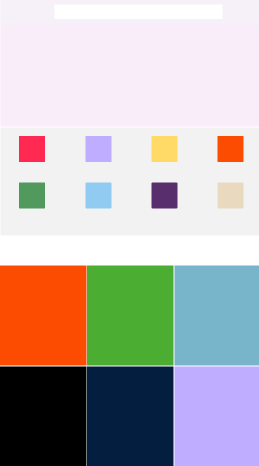

# React-Demo

## Reactjs && Node && webpack



## install & run

clone

```
> $ git clone 
```

|| react && server directory 

```
> $ npm install
```

|| server directory 

```
> $ npm run start
```

|| react directory 

```
> $ npm run dev
```

|| react directory build index

```
> $ npm run build
```

open `http://localhost:8080/' in browersers，

后台服务端口为 `3000`

## 后台接口（jsonp request）


```
http://localhost:3000/data/swiper
```

otherapp

```
http://localhost:3000/data/otherapp
```

spike
```
http://localhost:3000/data/spike
```

more
```
http://localhost:3000/data/more
```

like
```
http://localhost:3000/data/like
```


footer
```
http://localhost:3000/data/footer
```
